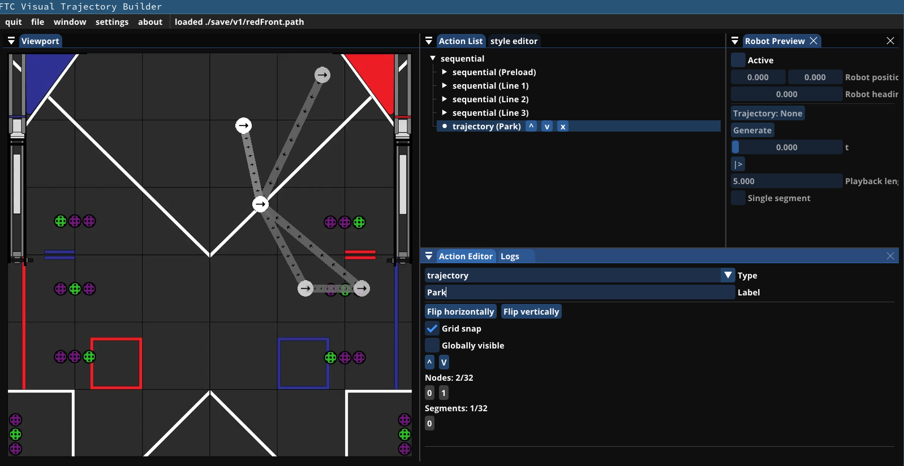
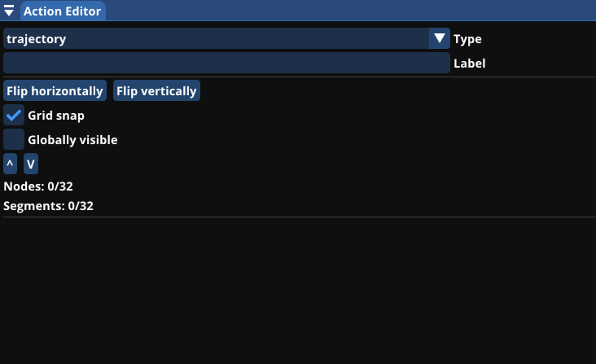
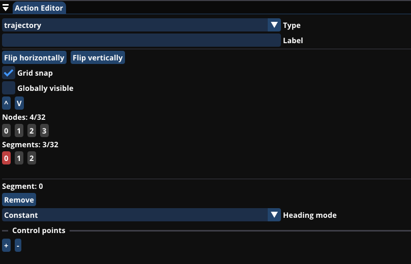
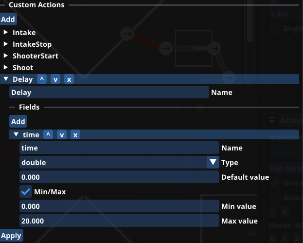
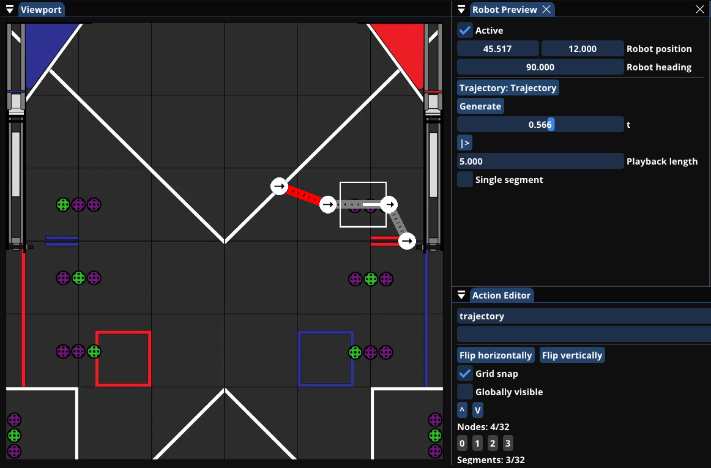

# FTC Visual Trajectory Builder

## Overview

A tool for creating action based autonomous opmodes for First Tech Challenge Robots using the Pedro Pathing or Roadrunner libraries.
  

## Actions

The action list panel shows all of the actions in your project in a tree view. These actions can be reorderd with the arrow buttons when they are selected or reparented by draging one on top of another.
When an action is selected you can configure it in the action edior panel. All actions have a type and a label. The type field determins what the action does, Sequential and Parallel actions are container actions that contain other actions for better organization of your path. Trajectory actions are paths that your robot follows and you can create your own action types that have their own fields.

## Trajectories

Trajectories are made of several nodes that are connected by segments. To create a node hold shift and click on the field in the viewport panel. Segments can be created between these nodes by selecting one of them and clicking on another while holding control.  
If your project is set to Roadrunner than you can curve your paths by changing the tangent of the segment. NOTE: This path is not exactly what it will be when it is run on the robot, the curves are generated in two different ways for performance and simplicity reasons.  
For Pedro Pathing you can create one or more control points by clicking the + under control points.  
The heading mode of the segment can be set to any of the options that the library that you are using provides.
  
Action Editor with a blank trajectory.  
  
Action Editor with an in progress trajectory.  

## Custom Actions

In the project settings tab of the settings menu you can create actions for the functions of your robot.  
These actions can have several fields so you can configure exactly how they work. The fields get added to the constructor of the action in the order that they are configured in.
  
Custom Actions part of settings window with several actions for the Decode game.

## Robot Preview

The robot preview can help you figure out exactly where to make your robot move to without hitting anything you dont want it to.  
To enable the preview click window on the top bar and select Robot Preview. Then check the active checkbox and you should see a white square on the field.  
This robot can be moved and rotated freely. To make it follow a trajectory drag your trajectory action on to the button that says "Trajectory: None".  
Then click generate to generate the path and adjust the t slider to see where the robot is on the path.  
To preview a specific segment of the path check the single segment checkbox and change the segment index to the index of the segment that you want to preview.  
  
Robot Preview following a trajectory.

## Exporting

Before exporting make sure that your auto is saved by clicking on the file button on the top bar and selecting save as.
Then in the settings menu you can set the language to export to, Java and Kotlin are the only options offered by default but other language can be added as lua scripts in the lang directory.
Click file then export to export your auto, it will be in the export directory.

## Compiling

Clone this repository onto your machine and run the script for your platform.
Mac support exists but has not been tested in some time and may not work.
